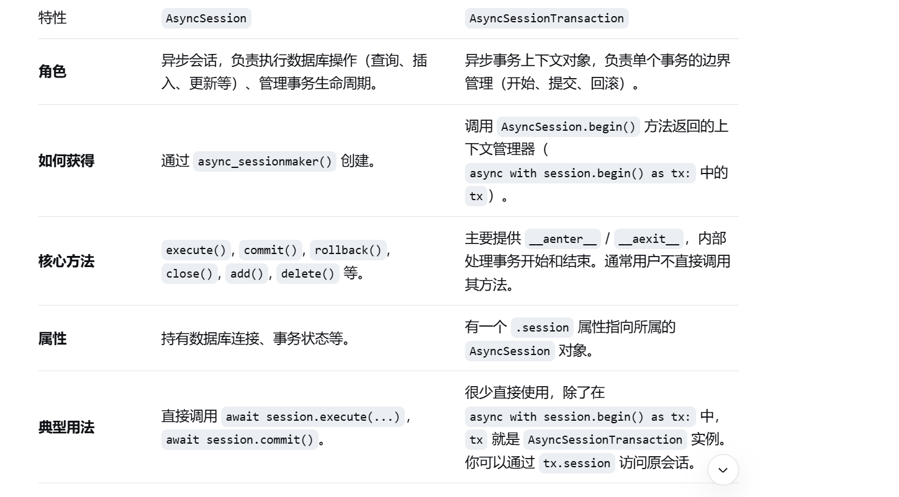

# ORM 查询语句

```python
from sqlalchemy import select
from sqlalchemy.orm import Session

db = Session()
result = await db.execute(select(User)) # select(模型类) ，单行数据就是一个ORM对象，多行数据就是一个列表
result.scalars().all() # 将结果转换为列表，,scarlars()是每列返回一个标量，result中每个元素都是ORM对象，每行一个ORM对象
result.all() # 将结果转换为元组
result.first() # 将结果转换为第一个元组
result.scalar() # 将结果转换为第一个元素
result.scalar_one() # 将结果转换为第一个元素，如果结果为空，则抛出异常
result.scalar_one_or_none() # 将结果转换为第一个元素，如果结果为空，则返回None
get(User, 1) # 根据主键查询单行数据
```

